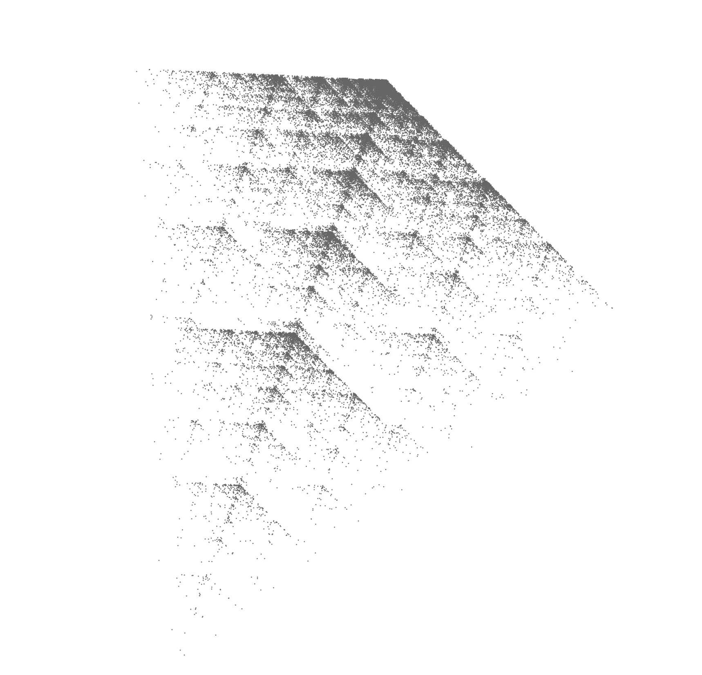
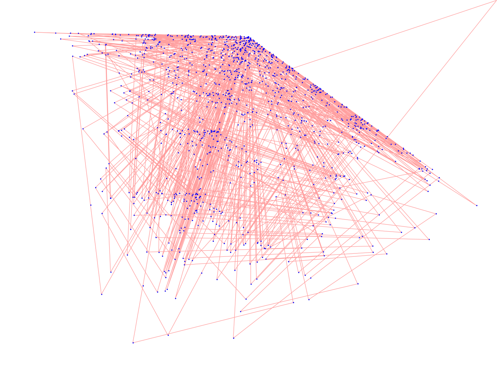
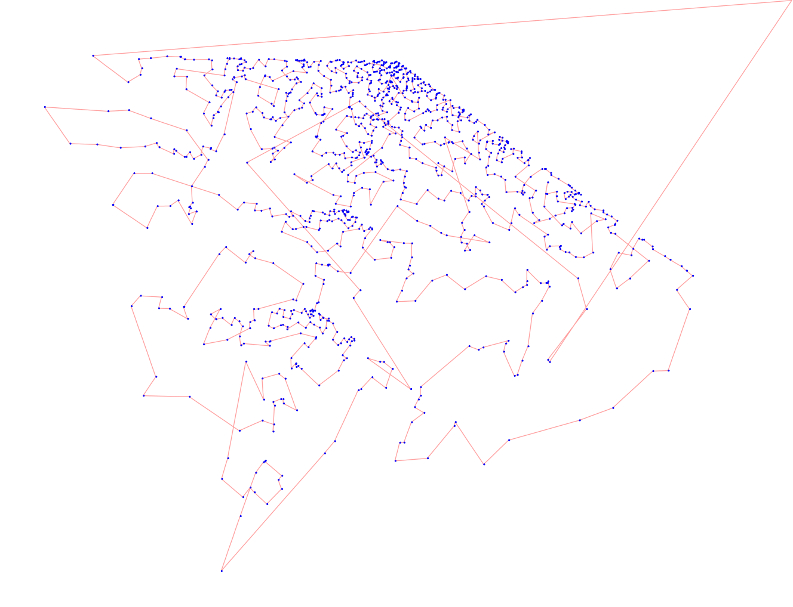

This sketch was kicked off by a coding train video on the chaos game. The chaos game algorithm is simple:

1. Pick a number of vertices with a fixed position (a triangle for example).

2. Start with a random starting dot somewhere on the screen.

3. Pick a random vertex from the ones you chose in step 1.

4. Put a new dot somewhere on the straight line between the starting dot and the chosen vertex.

5. Pick a new random vertex, but don't allow the previously picked vertex.

6. Put a new dot somewhere on the straight line between the previous dot and the chosen vertex.

7. repeat step 5 and 6 thousands of times. The more dots you use and the smaller they are, the better the result.

You'll notice that there are a couple of steps where you can tweak the algorithm. A big one is where on the straight line between the last dot and the randomly chosen vertex you put your new dot. Right in the middle yield a clear fractal, closer than that yields smaller groups of shapes. Placing the new dot farther than halfway is what gave me the most interesting result. It generates some kind of grit which makes the result less artificial.

A second important factor is the placements of the vertices. I recommend trying out all sorts of different configurations. What happens with convex shapes of n points? What happens with non-convex shapes? After some tinkering you should be able to achieve the same result as I got.

What I like most is how there is, from these simple rules, an emergence of a 3D cube shrouded in mist, almost sci-fi like.

## Plotting

Plotting tens of thousands of little points will take a long time and probably more than one pen. Exporting an SVG from the browser with thousands of SVG elements takes ages too, if it doesn't crash your browser first. To make things a little more practical, I increased the dot size and decreased the amount of dots to around 7000. The first plotting draft yielded nice results although there where some issues. 

The first issue is that points overlap so that plotting time is wasted drawing multiple times over the same spot. Another consequence is the accumulation of ink which causes soaked and wavy paper. If you use a gel pen, gel accumulation can cause the pen to get clogged. This problem was solved by a simple check: only draw a new dot if there is no other dot already there. To save on computation time I implemented this using a quadtree although it must be said that this technique, together with the smaller amount of dots, makes the digital sketch less attractive.

A second issue is that plotting happens in the same order the dots are drawn, so the space between dots is very large. This causes for a lot of wasted time moving the pen between dots. After realizing 2D sorting is more difficult than anticipated. I came up with the following solution that is executed once on exportation: start with the point p where p.x * p.y is lowest. This gets you a point in a corner. Next, iterate all points and mark the closest one as the next point. Keep doing this for the remaining points and it will yield you a set of points with an increasing amount of space between them. This effectively cut my plotting time from 1 hour and 30 minutes to 45 minutes.

You can see the unoptimized and optimized plotting paths on these two pictures (blue is pen DOWN, red is pen UP, amount of dots has been drastically reduced):

I also had to take into account the dot size, because a dot is actually a really small circle. When using a small enough pen you can actually see this circle:

The best results is on black paper with a light gel pen.