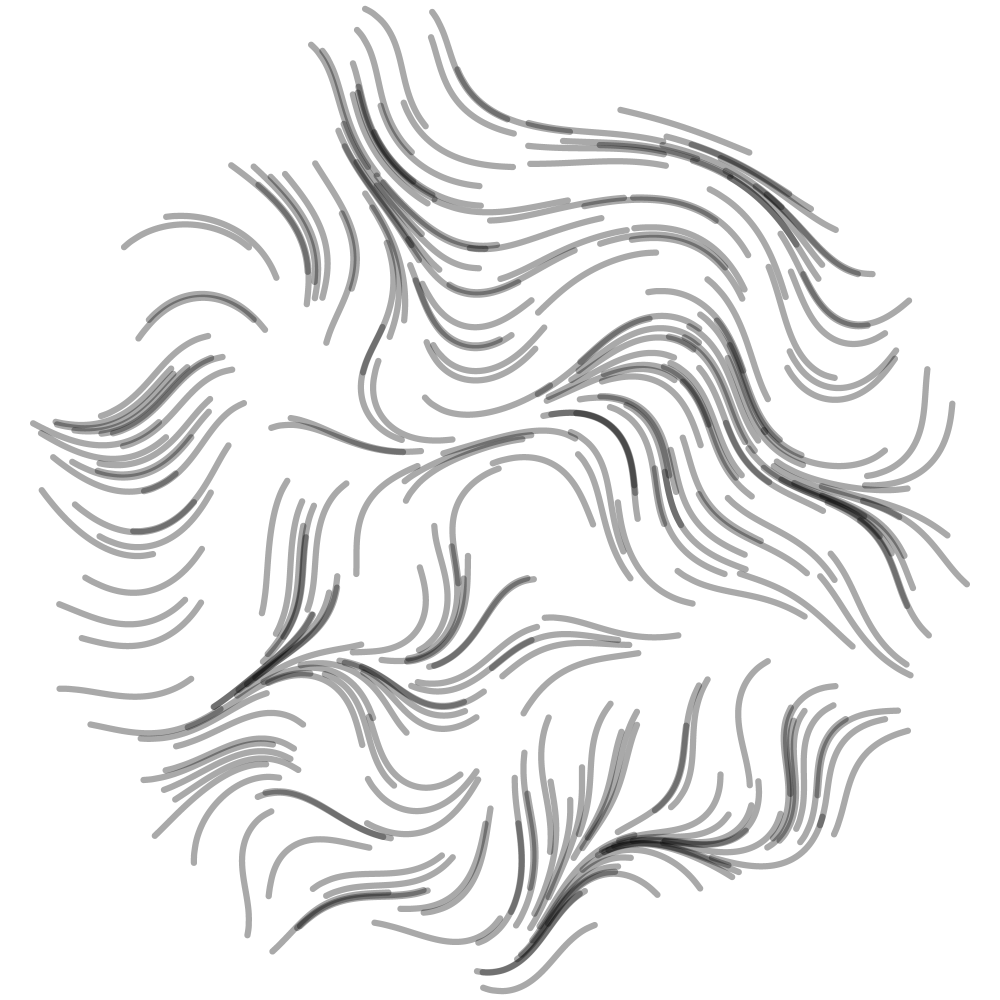
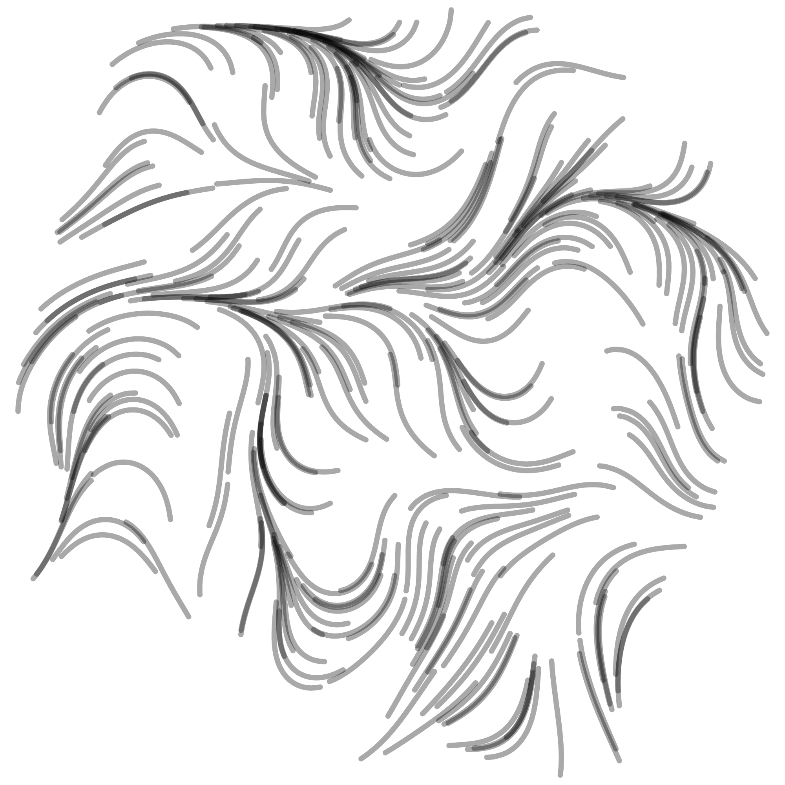
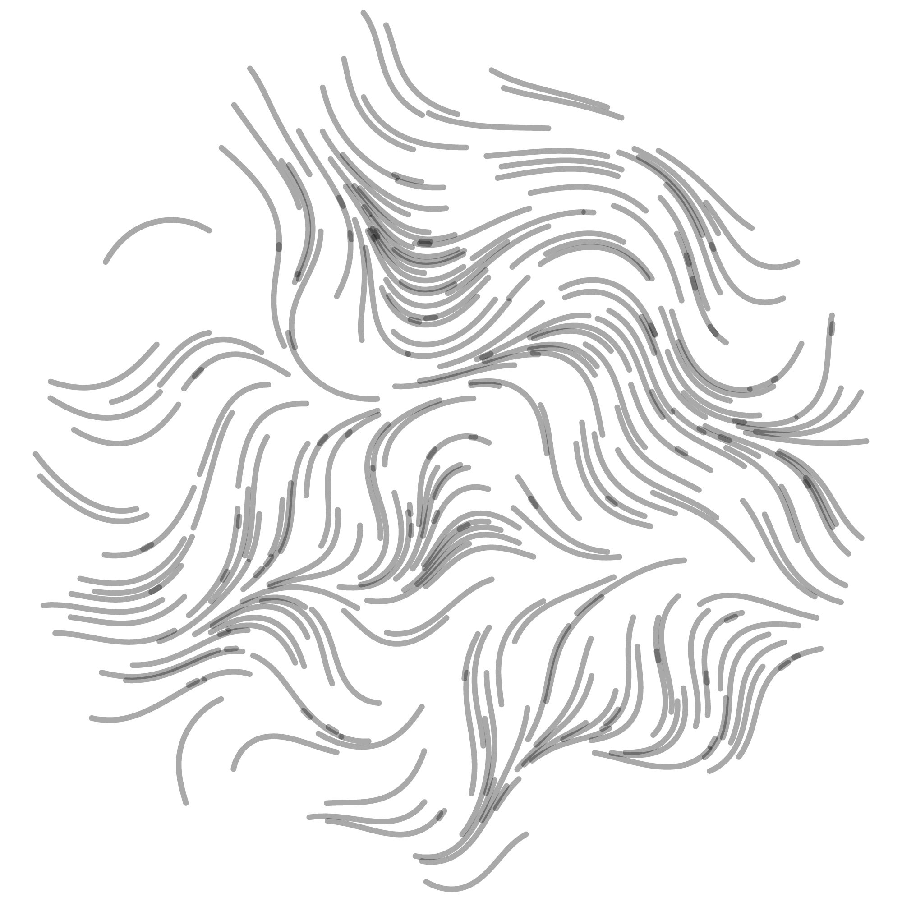

This drawing consists of a number of paths that originate from a circle. They follow an OpenSimplex noisefield until they have a certain length or collide with another stream. The path is determent step-by-step and because of path smoothing, I don't need to add a vertex every pixel but can use a step size of about 10ish.

At first all the streams where drawn at the same time but this soon became too computationally expensive as each stream has to look for a collision with all the other streams. This was later changed to drawing each stream after another so that each stream only had to check for collisions with the streams that came before. This is still not very efficiënt but a step in the right direction. Especially the use of Paperjs' `intersects` method is very slow. Another problem with intersect is it does not take stroke width into account so there will still be a good amount of overlap. Also, because the direction a stream makes is based on OpenSimplex noise, lines close to eachother tend to run parallel. This causes lines to not actually intersect, to the point I wonder if the intersects method actually ever worked. Below is a picture using no intersect detection allow, in other words all streams run until they have reached their maximum length:

Here is one where streams are stopped when an intersection is detected:

As a solution to all this, I ended up using Paperjs' `hitTest` method which detects if a point hits a path, stroke width included. The point used is the most recent vertex of the path being drawn:

For digital screens this method is completely superfluous, and makes the graphic actually a little less atractive in my opinion. It is however very necessary when plotting it, especially using a fountain pen. Since plotting over the same spot a couple of times completely destroys the paper.